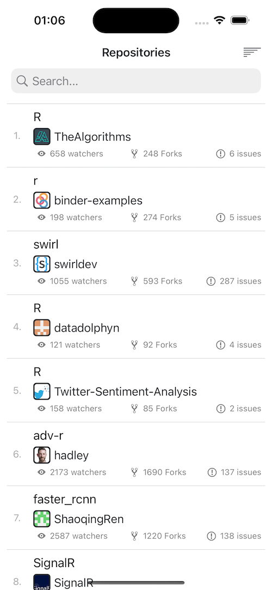
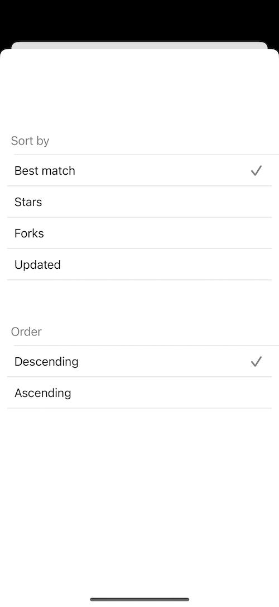
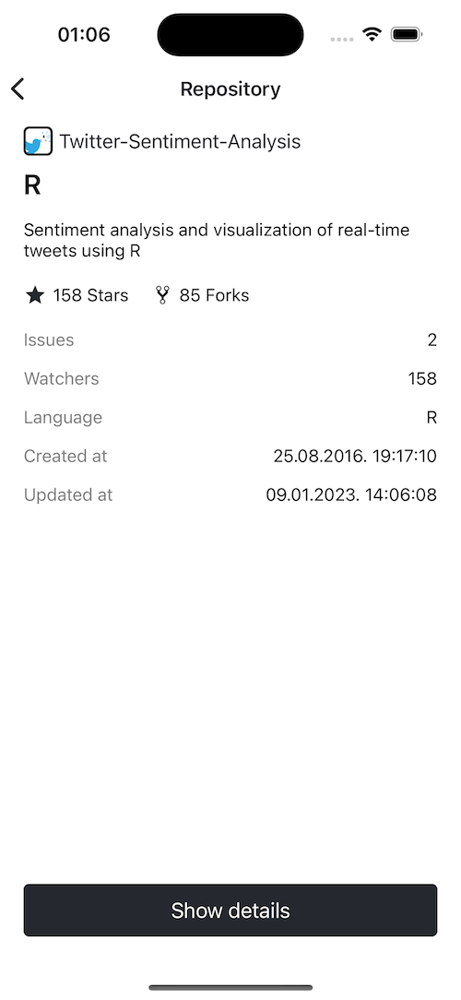

**GitHub repo search**

This repository contains an Xcode project for building an application with the possibility to search GitHub repositories. 
The project uses the Clean Swift architecture and the UI was written programmatically without the use of xib files or storyboards.
Additionally, the project contains Unit tests for testing the most essential logic in the project.

CocoaPods used in the project:
* SnapKit
* Kingfisher
* SwiftLint 

To run the project in Xcode double click the GitHubRepoSearch.xcworkspace file.

*Preview*

Home screen:

Sort:

Repository details screen:

User details screen:

